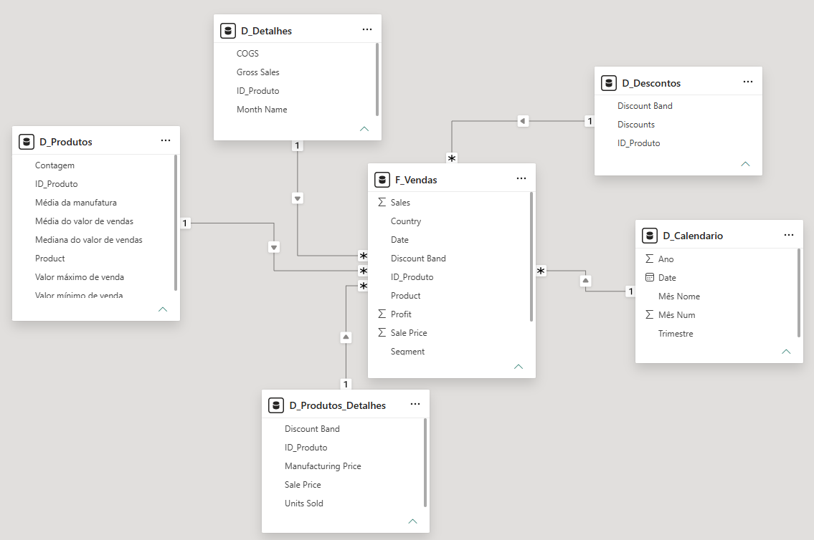

# 🛒 Modelando um Dashboard de E-commerce com Power BI (Star Schema & DAX)


## 📝 Sobre o Projeto

Este projeto foi desenvolvido como parte de um desafio prático da [Digital Innovation One (DIO)](https://www.dio.me/) dentro do Bootcamp Universia - Primeiros Passos em Power BI  
O objetivo principal foi transformar uma base de dados financeira desnormalizada (*flat table* — `Financial Sample`) em uma estrutura dimensional otimizada no padrão **Star Schema (Esquema em Estrela)**, aplicando técnicas de **ETL no Power Query** e criação de uma **tabela de tempo em DAX**.

## ⚙️ Processo de Construção e ETL no Power Query

A etapa de transformação de dados foi realizada no Power Query, garantindo rastreabilidade e integridade da informação:

- **Consulta de Origem e Backup (`Financials_origem`)**: Importação da tabela original com a opção “Habilitar Carga” desativada, para servir como backup de segurança.
- **Base de Apoio e Indexação (`Base_Apoio`)**: Criação de uma consulta intermediária para gerar a chave condicional `ID_Produto` (mapeada de 0 a 5 com base na coluna `Product`).
- **Tabela Fato (`F_Vendas`)**: Seleção das métricas de vendas e chaves estrangeiras, acrescida da chave substituta `SK_ID` (coluna de índice iniciada em 1).
- **Agrupamentos e Agregações (`D_Produtos`)**: Uso da funcionalidade “Agrupar Por” para calcular métricas de produto (médias, medianas, valores máximos e mínimos de vendas e custos de manufatura).
- **Criação das Demais Dimensões (`D_Produtos_Detalhes`, `D_Descontos` e `D_Detalhes`)**: Derivação das tabelas de atributos específicos a partir da consulta base.

## 🛠️ Refinamento do Modelo: Erros Identificados e Soluções Aplicadas

Durante a construção da modelagem relacional, foram identificados e corrigidos desafios comuns no processo de estruturação de um Star Schema:

### ❌ Erro 1: Cardinalidade Muitos-para-Muitos (`*:*`) nas Dimensões

- **Problema**: Inicialmente, tabelas como `D_Produtos_Detalhes` e `D_Descontos` apresentavam linhas com `ID_Produto` duplicados, o que levou o Power BI a sugerir relacionamentos de cardinalidade `*:*` (Muitos para Muitos).
- **Impacto**: Ambiguidade nos filtros, risco de duplicação de métricas numéricas e perda de performance no motor DAX.
- **Solução**: Execução da etapa “Remover Duplicadas” sobre a coluna `ID_Produto` em cada uma das tabelas dimensão no Power Query, garantindo a unicidade das chaves e estabelecendo a cardinalidade correta de `1:*` (Um para Muitos).

### ❌ Erro 2: Relacionamentos Cruzados entre Dimensões e Filtro Bidirecional

- **Problema**: O Power BI autodetectou e criou conexões diretas entre as próprias tabelas dimensão (ex.: `D_Produtos` conectada à `D_Detalhes`), gerando relacionamentos cruzados e filtros bidirecionais.
- **Impacto**: Quebra da arquitetura em estrela (Star Schema), transformando o modelo em uma estrutura irregular com dependências circulares de filtro.
- **Solução**: Remoção manual de todas as conexões existentes entre as tabelas dimensão. O modelo foi reestruturado para que todas as 5 dimensões se conectem exclusivamente e de forma unidirecional com a tabela fato central `F_Vendas`.

## 📊 Arquitetura Final do Modelo (Star Schema)

A arquitetura final resulta em um Esquema em Estrela totalmente limpo, funcional e performático:

### Estrutura dos Relacionamentos (`1:*`)

- `D_Produtos` (1) ➔ (*) `F_Vendas` via `ID_Produto`
- `D_Produtos_Detalhes` (1) ➔ (*) `F_Vendas` via `ID_Produto`
- `D_Descontos` (1) ➔ (*) `F_Vendas` via `ID_Produto`
- `D_Detalhes` (1) ➔ (*) `F_Vendas` via `ID_Produto`
- `D_Calendario` (1) ➔ (*) `F_Vendas` via `Date`

## 🧮 Inteligência de Tempo com DAX

Para permitir análises temporais contínuas e flexíveis, a tabela `D_Calendario` foi gerada via código DAX:

```DAX
D_Calendario = 
ADDCOLUMNS(
    CALENDARAUTO(),
    "Ano", YEAR([Date]),
    "Mês Num", MONTH([Date]),
    "Mês Nome", FORMAT([Date], "MMMM"),
    "Trimestre", "Q" & FORMAT([Date], "Q")
)
```

## 🚀 Como Visualizar este Projeto

1. Clone este repositório ou faça o download dos arquivos.
2. Abra o arquivo `.pbix` no Power BI Desktop.
3. Acesse a **Exibição de Modelo** para conferir o diagrama Star Schema.
4. Clique em **Transformar Dados** para inspecionar todas as etapas aplicadas no Power Query.

---

Desenvolvido por **Mariana Marques** , com ajuda da DIO e do Gemini 🚀  