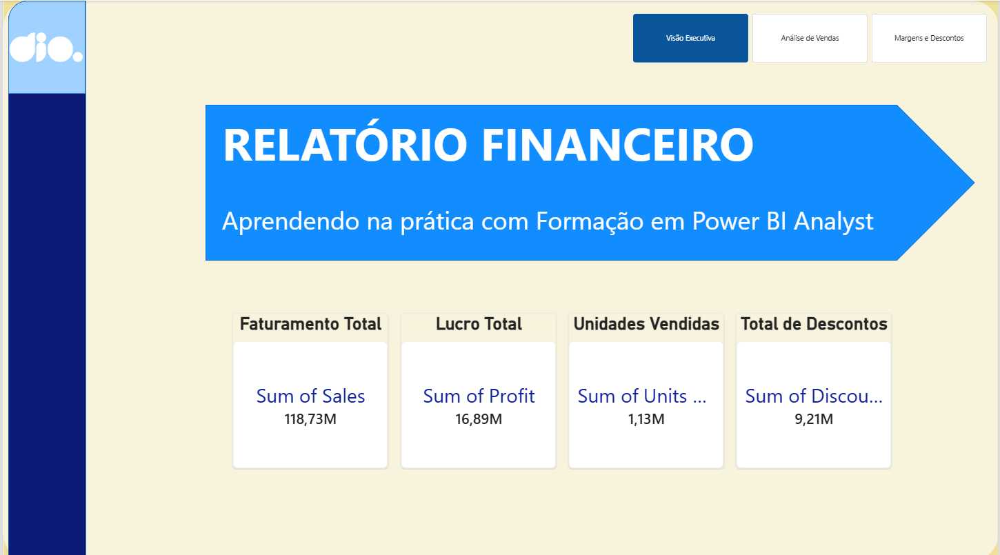
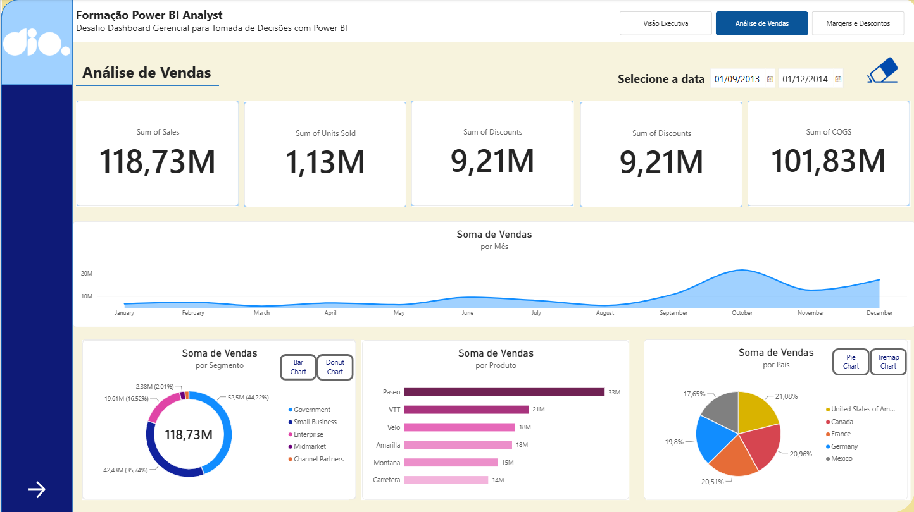
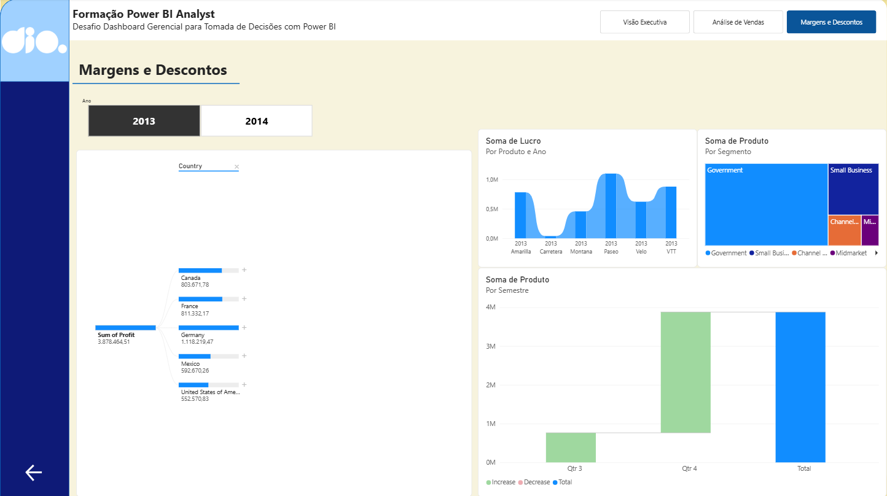

# 📊 Dashboard Gerencial para Tomada de Decisões (Power BI & UX/UI)

## 📝 Sobre o Projeto

Este projeto foi desenvolvido como desafio prático da plataforma [Digital Innovation One (DIO)](https://www.dio.me/). O foco principal foi reestruturar um relatório financeiro, priorizando a **Experiência do Usuário (UX)**, a **Arquitetura Visual** e a **Navegabilidade**, transformando dados brutos em uma ferramenta gerencial intuitiva para a tomada de decisões.

## 🎨 Princípios de UX/UI Aplicados

A reformulação do relatório seguiu os pilares fundamentais do design de dashboards:

- **Hierarquia e Posicionamento (Proporção Áurea):** Disposição dos cartões de métricas primárias (KPIs) no topo à esquerda, seguindo o padrão de leitura em Z, direcionando o olhar do usuário do contexto geral para o detalhamento.
- **Contraste e Paleta de Cores:** Redução de ruídos visuais com fundo neutro e aplicação estratégica de cores contrastantes para destacar apenas as métricas de maior impacto e alertas de negócio.
- **Segmentação e Filtros:** Organização de segmentadores de dados dinâmicos (por Período, País e Segmento) situados estrategicamente para fácil acesso, sem poluir a área dos visuais.
- **Alinhamento e Espaçamento:** Padronização de margens, tamanhos de fontes e bordas arredondadas nos cartões para uma estética moderna e limpa.

## 🧭 Estrutura e Navegabilidade do Relatório

O relatório foi estruturado em 3 páginas correlacionadas, conectadas por menus interativos:

1. **Página 1 – Visão Executiva:** Painel consolidado com os principais indicadores de desempenho (Faturamento Total, Lucro, Média de Vendas) e visuais de linha do tempo.
2. **Página 2 – Análise de Vendas e Categoria:** Matriz descritiva detalhada com comportamento de vendas por produto, segmento e países.
3. **Página 3 – Margens e Descontos:** Visão analítica sobre faixas de descontos concedidas e seu impacto na margem de lucro.

### 🔘 Botões e Estados Interativos

Foram configurados botões dinâmicos de navegação com estados personalizados:

- **Padrão (Default):** Estilo sutil indicando opções disponíveis.
- **Ao Apontar (Hover):** Alteração de cor e realce visual na passagem do mouse para feedback tátil ao usuário.
- **Selecionado (Selected):** Destaque em cor primária para sinalizar a página ativa no momento.

## 🛠️ Detalhamento das Atividades Realizadas (Passo a Passo)

Nesta etapa do desafio, o relatório financeiro original foi totalmente reformulado com foco na **Experiência do Usuário (UX)**, **Design de Dashboards (UI)** e **Navegabilidade Interativa**.

Foi usado como base o relatório criativo confeccionado para o Módulo 2 deste Bootcamp – Primeiros Passos em Power BI da DIO.

### 1. Estruturação e Organização do Relatório

**Divisão em 3 Páginas Temáticas:** Organização e padronização das abas inferiores do relatório em três visões complementares:

- **Visão Executiva:** Página inicial focada nos indicadores de alto nível (KPIs).
- **Análise de Vendas:** Visão detalhada do comportamento de vendas por segmento, produto e país.
- **Margens e Descontos:** Análise da rentabilidade, lucros por trimestre e distribuição de descontos.

### 2. Construção da Página Inicial (Visão Executiva)

**Criação dos Cartões de KPIs Primários:**  
Inserção e configuração do visual de Cartão (Card) para exibir as métricas essenciais:

- **Faturamento Total:** Soma da coluna `Sales`.
- **Lucro Total:** Soma da coluna `Profit`.
- **Unidades Vendidas:** Soma da coluna `Units Sold`.
- **Total de Descontos:** Soma da coluna `Discounts`.

**Formatação Visual dos Cartões:**

- Padronização de fontes, tamanhos (28pt) e cores de alto contraste.
- Aplicação de bordas arredondadas (8px) e efeito de sombra (Drop Shadow) para destaque estético de cada indicador.
- Alinhamento e Espaçamento: Seleção simultânea dos cartões para alinhamento automático no topo e distribuição horizontal uniforme.

**Título do Relatório:**  
Criação de um novo formato para o título:  
**“Relatório Financeiro – Aprendendo na Prática com Formação em Power BI Analyst”**.

### 3. Aplicação de Princípios de UX/UI

**Hierarquia Visual (Proporção Áurea / Padrão em Z):**  
Posicionamento dos KPIs mais importantes no topo superior esquerdo (ponto inicial de leitura do olho humano), descendo para os visuais de detalhamento e tendência temporal.

**Contraste e Cores Funcionais:**

- Definição de plano de fundo neutro em tom claro (`#F3F4F6`) com a área dos visuais em branco puro, reduzindo o cansaço visual.
- Utilização limitada de cores para evitar poluição visual, mantendo tons de destaque apenas para chamar a atenção para valores importantes.

**Segmentação Dinâmica:**  
Organização de segmentadores de dados (Slicers) por Data/Período, Ano e País no topo de cada página para facilitar a navegação do gestor.

### 4. Implementação do Menu de Navegação e Efeitos de Botões

**Inserção do Navegador de Páginas:**  
Utilização do recurso nativo **Inserir > Botões > Navegador > Navegador de Páginas** para gerar automaticamente o menu com as três páginas do relatório.

**Personalização dos Estados do Botão (Button States):**

- **Padrão (Default):** Fundo neutro e texto sóbrio para páginas inativas.
- **Ao Apontar (On Hover):** Alteração de cor de preenchimento e realce de borda ao passar o cursor do mouse, proporcionando feedback tátil imediato ao usuário.
- **Ao Selecionar (Selected):** Destaque em cor primária e texto em negrito para sinalizar claramente em qual página o usuário se encontra no momento.

**Padronização do Menu:**  
Replicação do menu de navegação na mesma posição exata no topo das 3 páginas do relatório, mantendo a consistência de navegação.

### 5. Validação de Usabilidade e Publicação

**Testes de Navegação:**  
Teste de cliques e transição entre as páginas no Power BI Desktop utilizando o comando **CTRL + Clique**.

**Documentação para Portfólio:**  
Extração do arquivo `.pbix` e capturas de tela (prints) das 3 páginas do relatório interativo para estruturação do repositório no GitHub e envio da entrega da formação.

## 🛠️ Tecnologias e Funcionalidades Utilizadas

- **Power BI Desktop:** Construção do relatório e formatação condicional.
- **Navegador de Páginas e Ações de Botões:** Navegação nativa e menus fluidos.
- **DAX:** Métricas calculadas para KPIs de desempenho.
- **Storytelling de Dados:** Transição lógica entre contexto gerencial e detalhes operacionais.

## 🚀 Como Executar o Projeto

1. Faça o download ou clone este repositório.
2. Baixe o arquivo `.pbix`.
3. Abra no [Power BI Desktop](https://powerbi.microsoft.com/pt-br/desktop/).
4. Interaja com os botões superiores para testar os efeitos de Hover, Selected e a navegação entre as 3 páginas.

---

Desenvolvido por **Teacher Mariana Marques** com ajuda da DIO e do Gemini 🚀  