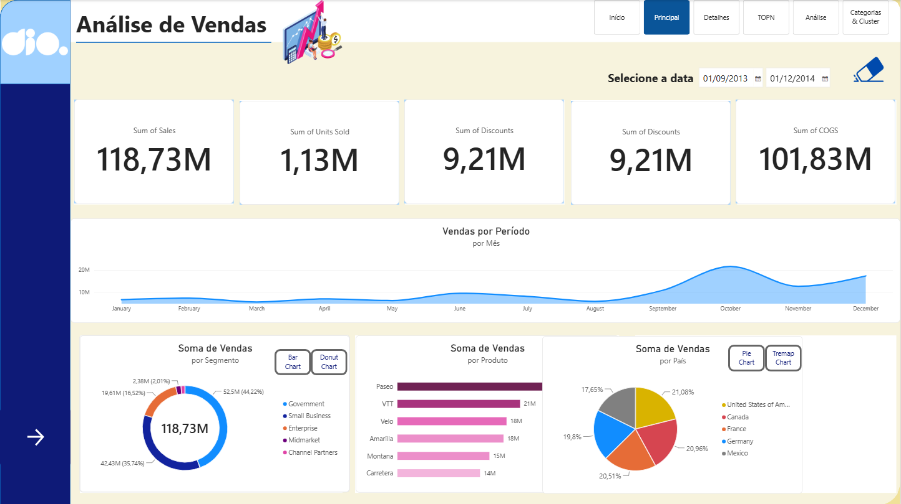
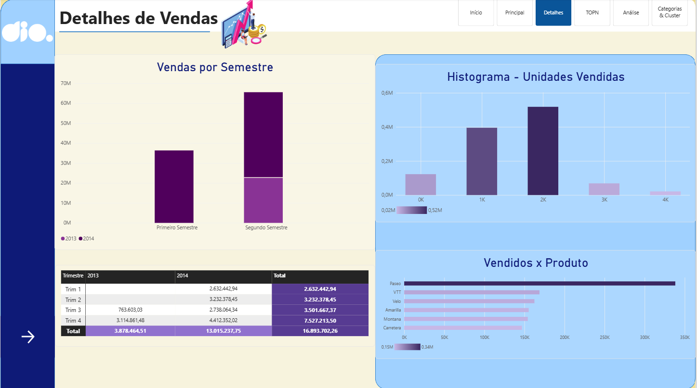
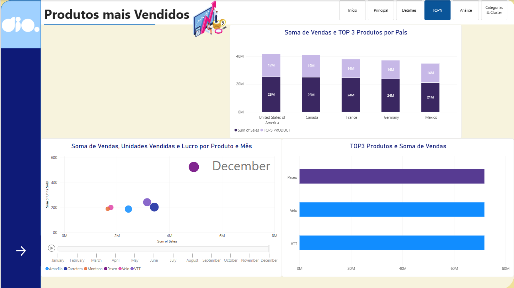
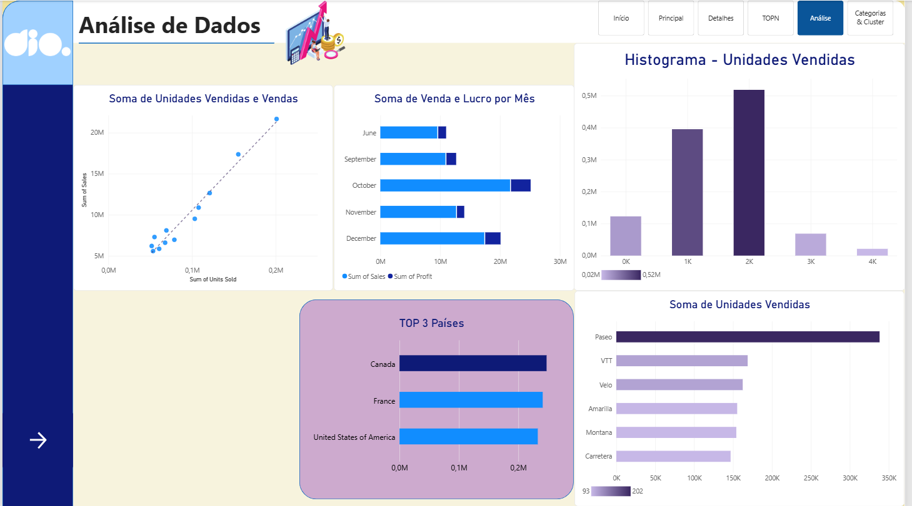
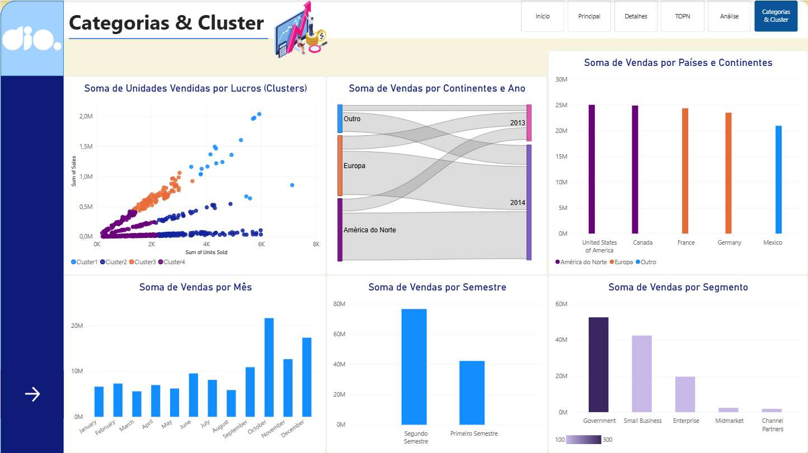

# 📈 Relatório de Vendas e Lucros com Foco em Data Analytics & Estatística (Power BI)


## 📝 Sobre o Projeto

Este projeto representa o desafio final do bootcamp da [Digital Innovation One (DIO)](https://www.dio.me/). O objetivo principal foi transformar um relatório financeiro tradicional em uma solução de **Data Analytics com viés estatístico**, aplicando técnicas de análise descritiva, identificação de outliers, correlação de variáveis, decomposição de causa raiz e análise de tendências no Power BI.

---

## 🔬 Abordagem Analítica e Recursos Estatísticos Aplicados

### 1. Análise de Correlação e Dispersão

- **Gráfico de dispersão:** análise da relação entre unidades vendidas, vendas e lucro.
- **Linha de tendência:** identificação da direção da relação entre as variáveis.
- **Análise por clusters:** comparação do comportamento dos registros de acordo com seus grupos de desempenho.

### 2. Análise de Causa e Segmentação

- **Análise por país, continente e segmento:** identificação das regiões e categorias com maior participação nas vendas.
- **Visualização de clusters:** comparação entre unidades vendidas e resultados financeiros.
- **Árvore de análise e filtros interativos:** exploração dos fatores relacionados ao desempenho comercial.

### 3. Análise Temporal

- **Vendas por mês:** identificação de períodos de maior e menor desempenho.
- **Vendas por semestre:** comparação entre o primeiro e o segundo semestre.
- **Análise por trimestre e ano:** acompanhamento da evolução das vendas ao longo do período analisado.

### 4. Estatística Descritiva com DAX

Foram utilizadas medidas DAX para apoiar a interpretação quantitativa dos dados:

- **Margem de lucro:** relação entre lucro e vendas.
- **Média de vendas:** valor médio das vendas analisadas.
- **Mediana de vendas:** medida de tendência central menos sensível a valores extremos.

```dax
// Medida para Margem de Lucro
Margem_Lucro_% = DIVIDE(SUM(financials[Profit]), SUM(financials[Sales]), 0)

// Medida para Média de Vendas
Media_Vendas = AVERAGE(financials[Sales])

// Medida para Mediana de Vendas
Mediana_Vendas = MEDIAN(financials[Sales])
```

---

## 📊 Principais Visões do Dashboard

O relatório foi estruturado em diferentes páginas para facilitar a navegação e a análise dos dados:

### Página inicial

Apresentação do projeto e acesso às principais áreas do relatório.


### Visão principal

Painel executivo com KPIs de vendas, unidades vendidas, descontos e custo dos produtos, além de análises por período, segmento, produto e país.



### Detalhes de vendas

Análise detalhada por semestre, trimestre, unidades vendidas e produto, com apoio de tabelas, gráficos de barras e histograma.



### Análise de dados

Página dedicada à análise de relações entre unidades vendidas, vendas e lucro, além da comparação entre países e produtos.



### Produtos mais vendidos

Identificação dos produtos com maior volume de vendas e comparação do desempenho dos principais produtos por país e ao longo do tempo.



### Categorias e clusters

Análise de clusters, continentes, países, segmentos e evolução das vendas por mês e semestre.




---

## 🎨 Arquitetura Visual e UX/UI

O projeto também considerou princípios de organização visual e experiência do utilizador:

- **Navegação por páginas:** botões para alternar entre as visões do relatório.
- **Indicadores principais em destaque:** cartões com KPIs posicionados na parte superior do dashboard.
- **Paleta de cores consistente:** utilização de tons de azul, roxo e lilás para facilitar a leitura e manter a identidade visual.
- **Interatividade:** filtros de data, segmentações e recursos de exploração dos gráficos.
- **Hierarquia visual:** organização dos elementos para facilitar a leitura dos indicadores mais importantes.

---

## 🚀 Como Executar o Projeto

1. Clone ou faça o download deste repositório.
2. Abra o ficheiro `.pbix` no Power BI Desktop.
3. Caso necessário, atualize os caminhos das fontes de dados.
4. Navegue pelas páginas do relatório utilizando o menu superior.
5. Interaja com os filtros, gráficos e indicadores para explorar os resultados.

---

## 👩‍💻 Desenvolvido por

**Teacher Mariana Marques** com ajuda da DIO e do Gemini 🚀 

---

## 🎓 Bootcamp Digital Innovation One (DIO)

Este projeto foi desenvolvido como atividade final de formação em Power BI, com foco na criação de relatórios interativos, análise de indicadores, visualização de dados e aplicação de conceitos de Data Analytics.
